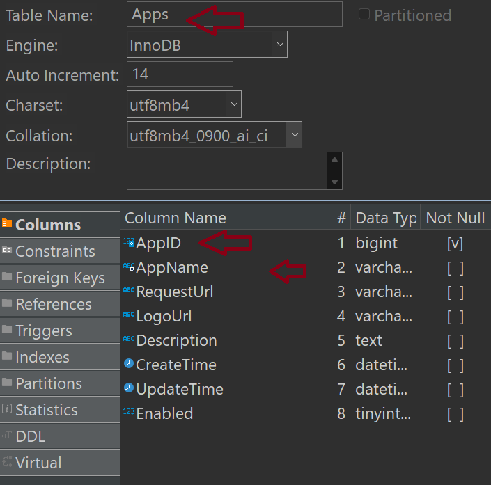
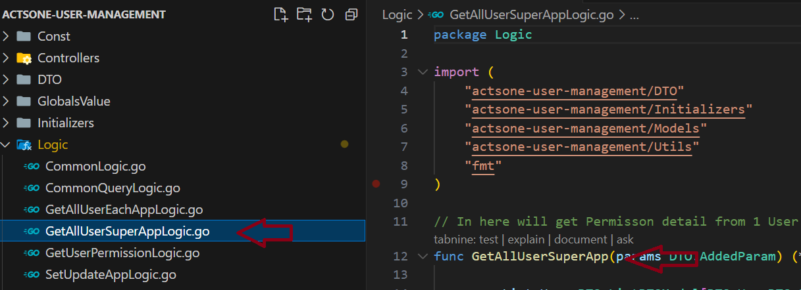
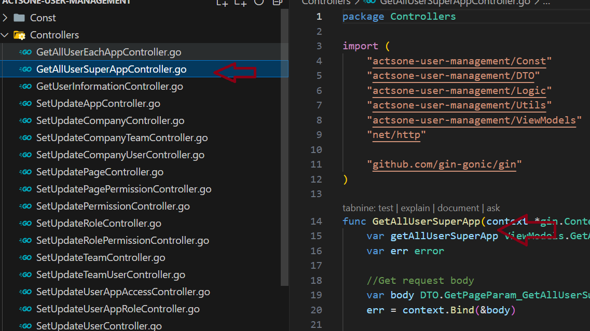
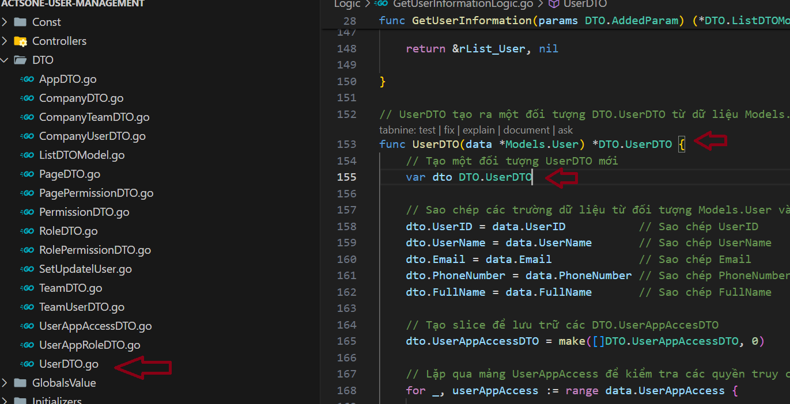
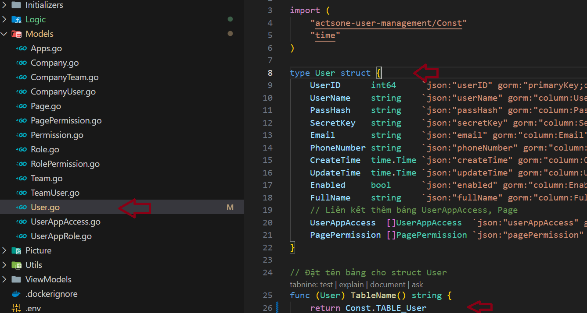

## Format chung cho Payload trả ra 

```
"result": "Success",
"errorMessage": "",
"pageIndex": 1,
"pageSize": 10,
"totalCount": 1,
"data": [
    {  "userID": 1,
            "userName": "hanguyen.actsone@gmail.com",
            "fullName": "Dan Linh",
            "email": "danlinhqn@gmail.com",
            "phoneNumber": "2123456",
            "createTime": "0001-01-01T00:00:00Z",
            "updateTime": "0001-01-01T00:00:00Z",
            "userAppAccess":
    }]
```


### Quy Chuẩn đặt tên cho bảng

***Ví Dụ:***

Tên bảng **Apps** thì Khóa chính = AppID



### Quy Chuẩn đặt tên hàm trong API golang 

Tên Hàm logic = Tên Hàm Controller

***Ví dụ:***





Tên các DTO giống nhau kể cả trong khi khai báo DTO trả ra ở hàm Logic

***Ví dụ:***



Tên Model không có "s" như tên bảng 

